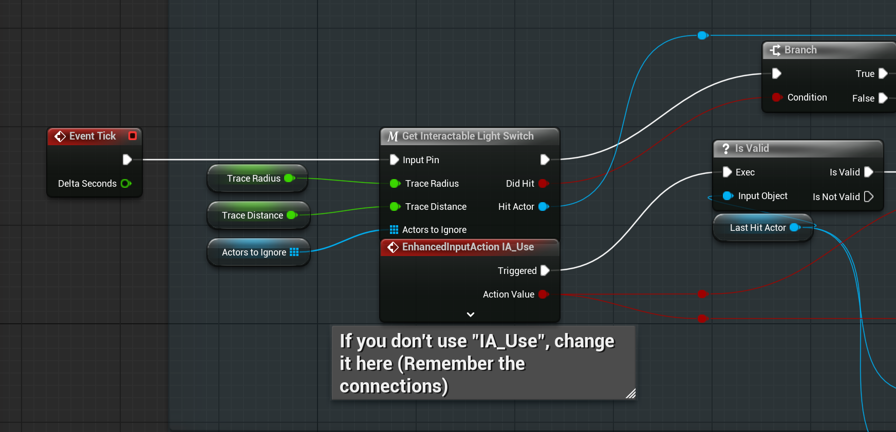

# UE5 Modular Light System

Developed with Unreal Engine 5

> ⚠️ Licensing Note  
This project is released under the MIT License.  
However, redistribution or republishing this package (in whole or parts) on the Unreal Engine Marketplace (Fab) or any other asset store is **not allowed**.  
Please respect the intent of the open source release.

---

  
  

  

A modular, dynamic, and highly customizable lighting system for Unreal Engine 5, built entirely with Blueprints.  
This system is designed for both gameplay logic and level design, allowing interactive lights, circuit behavior, and visual feedback directly in the editor.

This project is **completely free** and will also be released on the **Unreal Engine Marketplace (FAB)** once finalized.

---

## Features

- **Modular Light Blueprint `BP_Light`**: Easily place and configure lights with custom behavior.
- **Parallel & Series Circuits**: Simulate realistic chain reactions (e.g. if a light breaks, the chain is affected).
- **Trigger Volumes**: Use box, sphere or cylinder trigger zones to toggle lights.
- **Light Switch Blueprints `BP_LightTriggerSwitch`**: Link light switches to one or more lights or triggers (With an optional delay).
- **Destroyable Lights**: Optional damage system for destructible light actors (Currently set bool and turn intensity to 0).
- **Sound Integration**: Individual audio slots for:
    - Switch toggling
    - Light activation/deactivation
    - Flicker
    - Destruction
- **Flickering Lighting**: Optional flickering interpolation.
- **Gradient Lighting**: Color blending support with optional flickering interpolation.
- **Custom Settings**: Change light radius, color, type, orientation and more.
- **Smart Interaction**: Lights check if they're interactable before reacting (Player has to look at the switch / light).
- **Light Movement**: Lights can move randomly, on Hit change direction, also with a random direction change. (`WIP` Spline movement).
- **Light Strings `BP_LightString`**: Connect multiple lights in a chain on a cable (Currently only on the spine, because the physical cable is not a SkeletalMesh).
  - **Flicker + Gradient**: Flicker and gradient support for light strings (Same as single lights `BP_Light`).
- **Visual Debug Lines**: Circuit connections are drawn in the editor for easy overview (Only debug text is working, the lines are kinda broken).
- **Text Labels**: Show how many connections each light has and in which mode (Series/Parallel).

---

## How to Use

### 1. Add the Interaction Manager to the Level

Drag and drop `BP_LightInteractionManager` from
`Content/MLS/Blueprints/Manager/` into your level.

### 2. Enhanced Input System Required

Make sure your project uses the Enhanced Input System.
You must have an input action called `IA_Use` (Or you can change it inside the Blueprint `BP_LightInteractionManager`).

### 3. Set the Input Mapping

Open `BP_LightInteractionManager` and add your input mapping context to the Input Mapping field.
This ensures the interaction key (like `E`, `F`, etc.) works correctly.

### 4. Use Light Components

You can now use:
 - BP_Light
 - BP_LightSwitchTrigger
 - BP_LightString (`WIP`)
 - BP_PowerSupply (`WIP`)

Located under
`Content/MLS/Blueprints/Components/`

> ⚠️ A part of the Documentation is available here [Wiki](https://github.com/NullPointerExcy/UE5_ModularLightSystem/wiki).
Feel free to explore and try it out already, it's designed to be modular and intuitive!

---

## Planned Features

- [ ] <b>`WIP`</b> Power system (e.g. battery, generator, solar panel) with energy consumption and recharge. Which takes into account the power consumption of the lights, the power source, and the circuit type (Series, Parallel).
- [ ] Better circuit system (Currently uses a simple array of connected lights `BP_Light`).
- [ ] Save/Load system for light states
- [ ] Energy-based gameplay integration (power limiters, voltage drop, etc.)
- [ ] Light presets (e.g. flickering neon, broken halogen, sci-fi light pulses)
- [ ] Editor UI / Widget for circuit overview (Currently uses debug lines and text labels, and lines are kinda broken in UE)
- [ ] ... if you have suggestions, feel free to contribute or contact me
- [ ] <b>Better folder structure and documentation</b> xD
- [ ] FAB Marketplace release

---

## Requirements

- Unreal Engine 5.5+
- Blueprint-only project (no C++ required)
- Tested in UE 5.5.4 and should work out of the box

---

## Project Status

This project is actively developed. The core system is functional and stable.  
Contributions, feedback and suggestions are welcome!

---

## License

This project is licensed under the MIT License, see the [LICENSE](./LICENSE) file for details.

**Note:** You are **not permitted** to upload this content to the Unreal Marketplace (Fab) or any other commercial asset store without explicit permission from the author.

---

## Support

If you like this project, feel free to share it.  
Once the FAB release is live, links will be added here.
